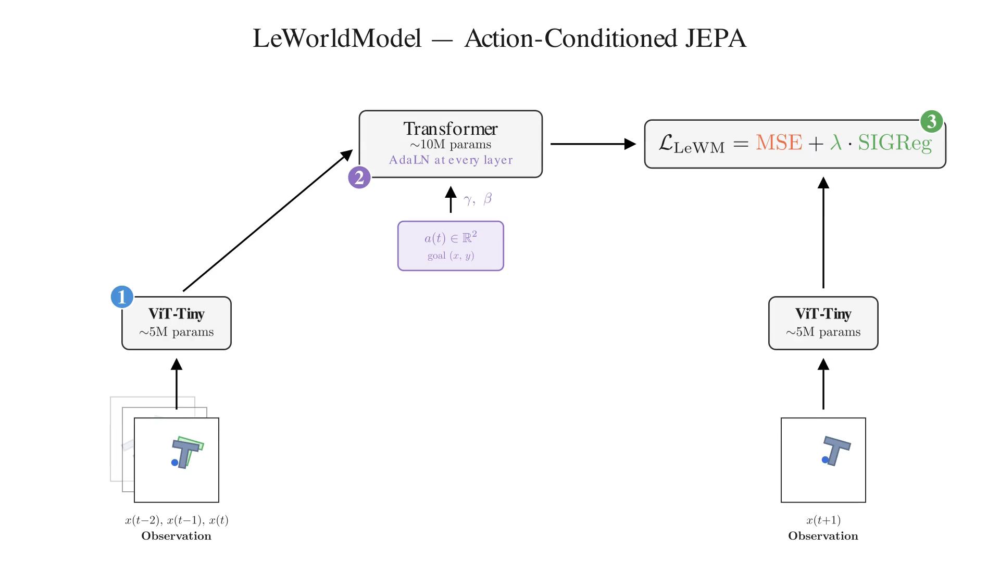

<h1 align="center">LeWorldModel — TUM Seminar Presentation</h1>

<p align="center">
A 20-minute seminar presentation for the <em>World Models</em> seminar at TU Munich, covering:<br>
<strong>LeWorldModel: Stable End-to-End Joint-Embedding Predictive Architecture from Pixels</strong> (arXiv 2603.19312)
</p>

<p align="center">
  
</p>

## Talk structure

**01 · Background & State of the Art** (slides 1–6)
- JEPA principle: predict in latent space, not pixel space
- Representation collapse: complete collapse vs. dimensional collapse
- SotA by anti-collapse strategy: EMA+stop-grad, frozen encoders, VICReg/multi-term losses
- SotA by target task: representation learning, generative control, latent action-conditioned WMs
- Where LeWM fits: only method that is end-to-end, reward-free, and trained with a single provably collapse-free regularizer

**02 · LeWorldModel** (slides 7–12)
- Architecture overview: ViT-Tiny encoder + action-conditioned AR predictor (Manim animation)
- ViT-Tiny encoder: patch tokenisation → CLS token embedding
- Action conditioning via AdaLN-Zero: scale/shift/gate generated from action embedding, zero-init for stable end-to-end training from pixels
- Why AdaLN-Zero over concatenation/addition: per-feature multiplicative influence
- Why isotropic Gaussian: Lemmas 1 & 2 (anisotropy amplifies bias and variance), Theorem 1 (𝒩(0,I) uniquely minimises downstream probing risk)
- SIGReg: Cramér–Wold sketching + Epps–Pulley normality test; full objective 𝓛 = MSE + λ·SIGReg (λ=0.1, M=1024)

**03 · Experiments** (slides TBD)
- Task performance and planning speed across PushT, Cube, TwoRooms, Reacher
- Physics emerges in latent space (probing); surprise detection

**04 · Discussion** (slides TBD)
- Authors' claims, personal assessment, open questions

## Tooling

- **Slides** — [Marimo](https://marimo.io/) reactive notebooks (`presentation.py`)
- **Animations** — [Manim Community](https://www.manim.community/) (rendered on first load, cached under `assets/`)

## Dependencies

In addition to the Python packages managed by `uv`, you need **ffmpeg** installed system-wide:

```bash
# macOS
brew install ffmpeg

# Ubuntu / Debian
sudo apt install ffmpeg
```

## Running the slides

```bash
uv sync
uv run marimo edit presentation.py
```

Once the notebook is open, switch to slideshow mode via the menu (or press `S`). Key shortcuts during the presentation:

| Key | Action |
|:---:|:---|
| `S` | Toggle presentation / speaker view |
| `F` | Toggle fullscreen |
| `→` / `Space` | Next slide |
| `←` | Previous slide |
